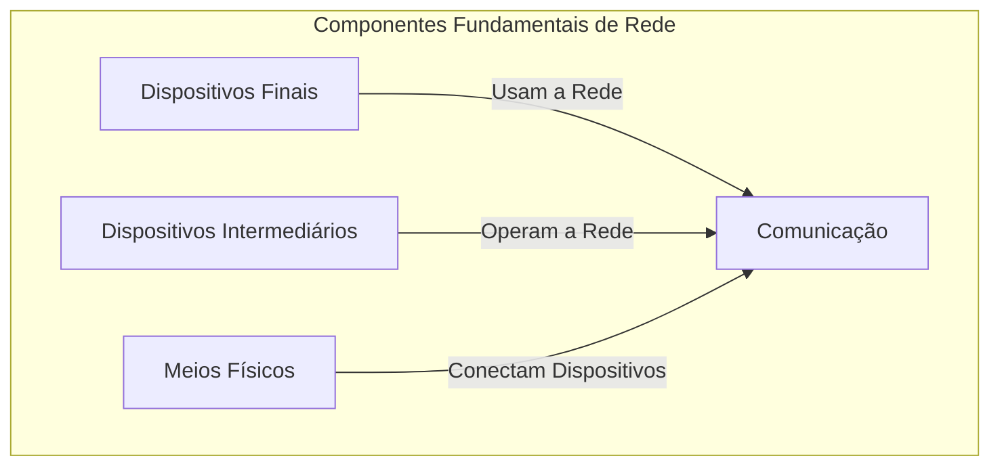
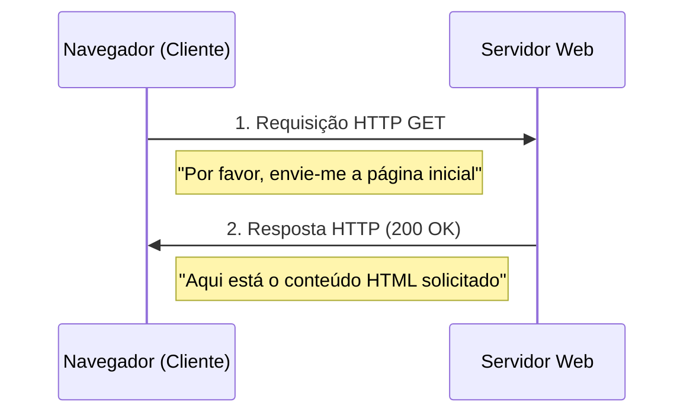
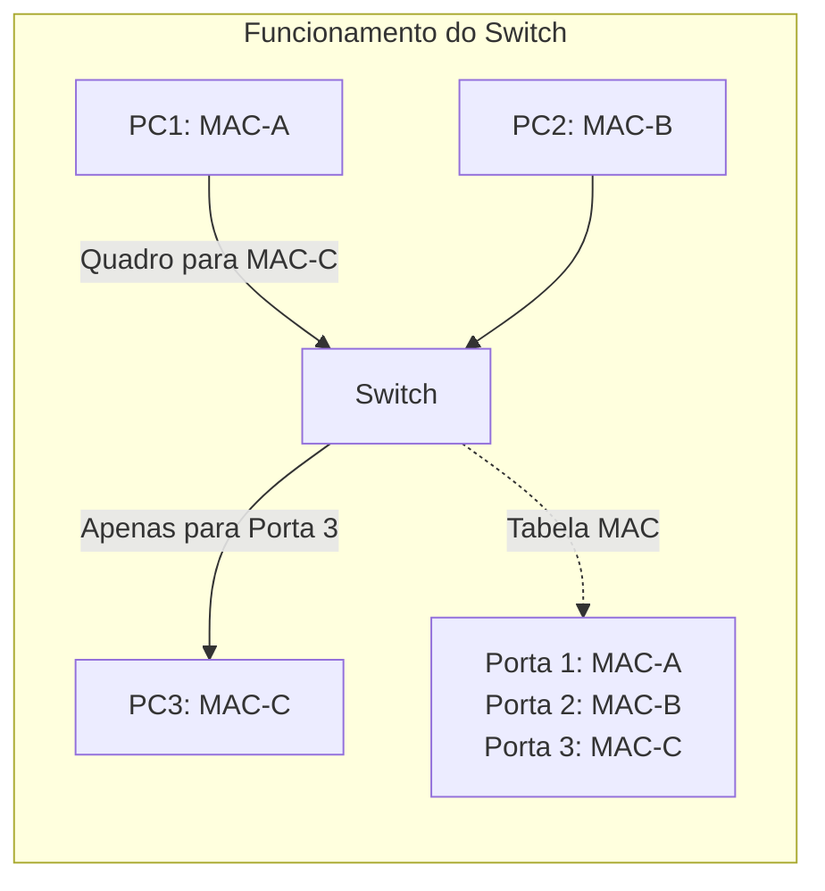
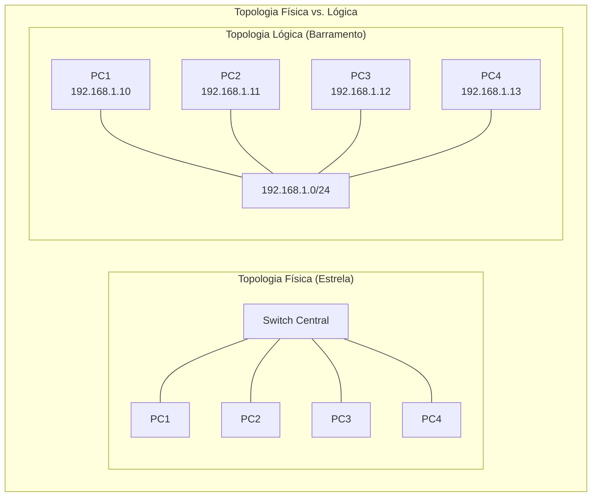
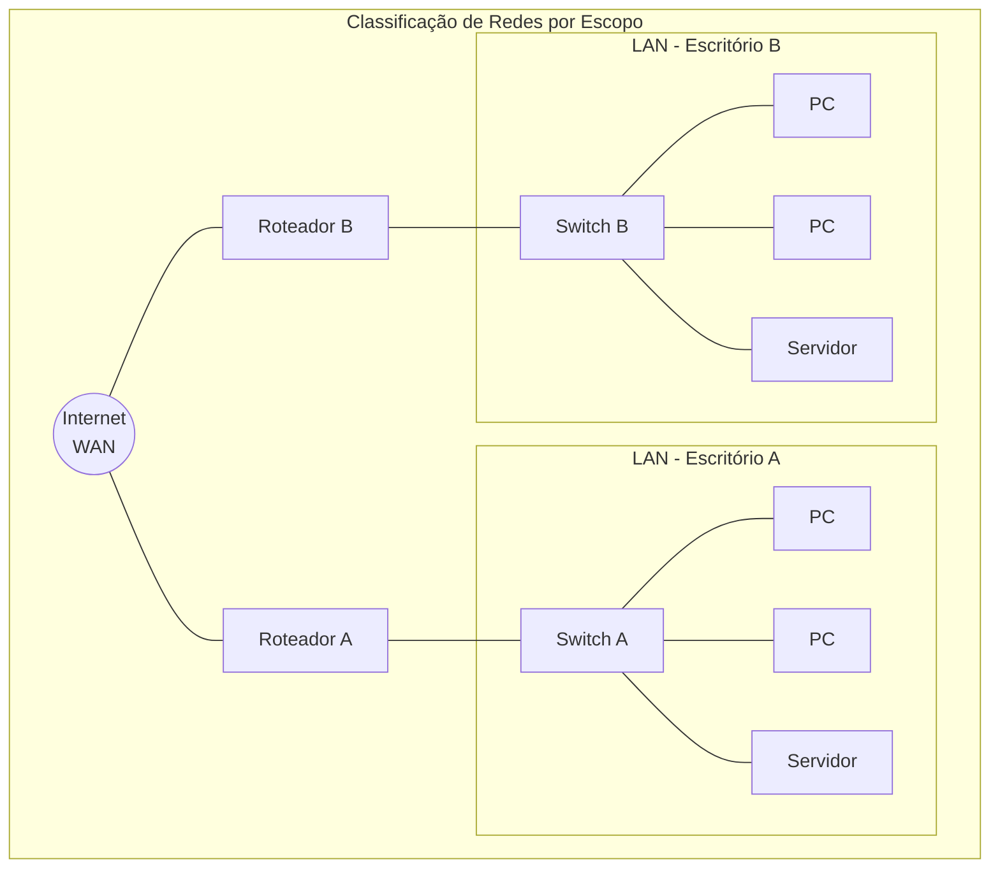
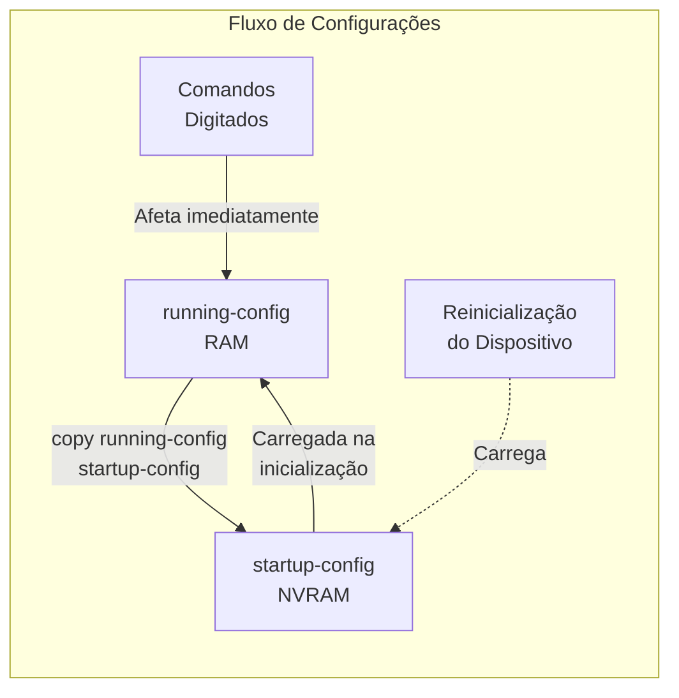

# **Fundamentos da Arquitetura de Redes e Cisco IOS**

## **Introdução: Construindo a Base do Conhecimento em Redes**

Bem-vindo a este guia de estudo. No universo da tecnologia, poucos campos são tão fundamentais quanto as redes de computadores. Elas são o sistema nervoso da nossa era digital, conectando tudo, desde o seu smartphone até os servidores que alimentam a economia global. Para um profissional da área, dominar seus fundamentos não é apenas um requisito, mas a chave para projetar, construir e manter sistemas de comunicação eficientes e seguros.

Neste material, vamos dissecar a anatomia de uma rede. Começaremos pelos seus componentes físicos e lógicos, entendendo o papel crucial de cada peça. Em seguida, classificaremos as redes por sua escala, da pequena rede local (LAN) à vasta rede global (WAN). Por fim, faremos uma imersão prática no cérebro que comanda grande parte da infraestrutura mundial: o sistema operacional **Cisco Internetwork Operating System (IOS)**. Ao final, você terá uma compreensão detalhada e contextualizada, pronta para ser aplicada em cenários do mundo real.

---

## **Seção 1: A Anatomia de uma Rede: Componentes e Arquitetura**

Toda rede é um ecossistema composto por três categorias de elementos que trabalham em harmonia: os dispositivos que usam a rede, os dispositivos que a operam e os meios que os conectam.



### **1.1. Dispositivos Finais (Hosts): A Interface com o Usuário**

Os hosts são o ponto de partida e de chegada de toda comunicação. São os computadores, servidores, impressoras e smartphones que nós, usuários, interagimos diretamente. Eles operam primariamente no modelo **cliente-servidor**.

> [!IMPORTANT]
> O modelo Cliente-Servidor é o paradigma fundamental que define como os serviços de rede são consumidos e fornecidos. Entender este modelo é essencial para compreender o funcionamento da internet.

* **O Modelo Cliente-Servidor na Prática:**  
  Pense em como você acessa um site. Seu navegador (o cliente) precisa de uma informação (a página web). Ele envia uma requisição através da rede para um computador específico (o servidor web), que hospeda essa informação. O servidor, por sua vez, processa a requisição e envia de volta os dados da página para que seu navegador a exiba. Este balé de requisição e resposta é a base de quase toda a atividade na internet.  
  


* **O Duplo Endereçamento: MAC e IP**  
  Para que essa comunicação funcione, cada host precisa de dois tipos de endereço, que atuam em camadas diferentes da rede:  
  
  * **Endereço MAC (Media Access Control):** É o endereço físico, gravado na placa de rede pelo fabricante. É um identificador único, como o número do chassi de um carro. Ele opera na **Camada 2 (Enlace)** e é usado para entregar dados dentro de um mesmo segmento de rede local (LAN).  
  
  * **Endereço IP (Internet Protocol):** É o endereço lógico, que identifica o dispositivo em uma rede mais ampla e permite que redes diferentes se comuniquem. Diferente do MAC, ele pode mudar dependendo da rede à qual o dispositivo está conectado, funcionando como um CEP. Ele opera na **Camada 3 (Rede)** e é essencial para o roteamento de dados pela internet.

> [!NOTE]
> A analogia mais simples para entender a diferença entre MAC e IP: o endereço MAC é como seu CPF (nunca muda e é único), enquanto o IP é como seu endereço residencial (pode mudar se você se mudar).

### **1.2. Dispositivos Intermediários: Os Operadores da Rede**

Esses são os heróis anônimos da rede, trabalhando nos bastidores para garantir que os dados cheguem ao seu destino de forma rápida e segura.

* **Switches (Operadores da Camada 2):**  
  Um switch é o organizador do tráfego dentro de uma rede local (LAN). Sua principal função é encaminhar os quadros (frames) de dados apenas para a porta do destinatário correto, evitando congestionamentos desnecessários.  
  
  * **Como um Switch Aprende?** Ele constrói dinamicamente uma **tabela de endereços MAC**. Quando um dispositivo envia dados, o switch "lê" o endereço MAC de origem e o associa à porta pela qual ele chegou. Da próxima vez que dados forem destinados àquele MAC, o switch saberá exatamente para qual porta encaminhá-los, em vez de enviar para todas (processo conhecido como *flooding*).  
  


* **Roteadores (Operadores da Camada 3):**  
  Um roteador é o dispositivo que conecta redes diferentes. Sua função é receber pacotes (packets) de dados, analisar o endereço IP de destino e, com base em seu "mapa" — a tabela de roteamento —, decidir qual o melhor caminho para encaminhar o pacote em direção ao seu destino final. Cada rede conectada a um roteador constitui um domínio de broadcast separado, o que significa que o tráfego de "anúncio geral" de uma rede não vaza para a outra, otimizando o desempenho. Na sua rede doméstica, o endereço IP do seu roteador é o seu Gateway Padrão, a porta de saída para a Internet.

> [!IMPORTANT]
> Switches e roteadores operam em diferentes camadas do modelo OSI: switches tomam decisões baseadas em endereços MAC (camada 2), enquanto roteadores usam endereços IP (camada 3) para tomar decisões de encaminhamento.

### **1.3. Meios Físicos: As Vias de Comunicação (Camada 1)**

O meio físico é a infraestrutura pela qual os bits viajam. A escolha depende de fatores como custo, distância e velocidade.

* **Cabos Metálicos (Par Trançado):** O padrão para redes locais cabeadas é o cabo UTP (Par Trançado Não Blindado). Os fios dentro do cabo são trançados para minimizar a interferência eletromagnética de fontes externas e o ruído (*crosstalk*) entre os próprios pares.  
  * **Padrões e Categorias:** Os cabos seguem padrões de pinagem como o **TIA/EIA-568A e 568B**. As categorias definem o desempenho: **Cat5e** suporta velocidades de até 1 Gbps, enquanto a **Cat6** suporta até 10 Gbps em distâncias mais curtas e oferece melhor proteção contra interferências.  
  
* **Fibra Óptica:** Utiliza pulsos de luz para transmitir dados, tornando-a imune a interferências eletromagnéticas e ideal para altíssimas velocidades e longas distâncias (backbones de internet, por exemplo).  
  
* **Redes Sem Fio (Wireless):** Utilizam ondas de rádio para a transmissão. A tecnologia é regida pelos padrões **IEEE 802.11**.  
  * **Padrões Comuns:** **802.11ac (Wi-Fi 5)** e **802.11ax (Wi-Fi 6)** são os mais utilizados hoje, operando nas frequências de **2.4 GHz** (maior alcance, menor velocidade, mais suscetível a interferências) e **5 GHz** (menor alcance, maior velocidade, menos congestionada).

| Meio Físico | Velocidade | Distância Máxima | Imunidade a Interferência | Custo Relativo |
|-------------|------------|------------------|-----------------------------|----------------|
| **UTP Cat5e** | Até 1 Gbps | 100m | Baixa | $ |
| **UTP Cat6** | Até 10 Gbps (55m) | 100m | Média | $$ |
| **Fibra Monomodo** | +100 Gbps | 100km+ | Alta | $$$$ |
| **Fibra Multimodo** | Até 100 Gbps | 2km | Alta | $$$ |
| **Wireless 802.11ax** | Até 9.6 Gbps (teórico) | 30-100m (variável) | Muito Baixa | $$ |

---

## **Seção 2: Classificando as Redes por Escopo e Topologia**

### **2.1. Topologias: Física vs. Lógica**

* **Topologia Física (Camada 1):** Refere-se a como os cabos são fisicamente dispostos e os dispositivos conectados. É a planta baixa da rede.  
* **Topologia Lógica (Camada 3):** Descreve como os dados fluem através da rede, independentemente da disposição física. É definida pelo esquema de endereçamento IP e pelas sub-redes.



### **2.2. Redes de Área Local (LANs e WLANs)**

Uma LAN cobre uma área geográfica limitada (escritório, casa). É caracterizada pela alta velocidade e administração privada. O padrão que define a maioria das LANs cabeadas é o **Ethernet (IEEE 802.3)**, enquanto as WLANs são definidas pelo **IEEE 802.11**. Uma **Intranet** é um tipo de LAN que usa tecnologias da internet (como servidores web) para fins internos de uma organização.

### **2.3. Redes de Longa Distância (WANs)**

Uma WAN interconecta múltiplas LANs sobre uma vasta área geográfica. A **Internet** é o exemplo máximo de uma WAN pública. Elas são tipicamente gerenciadas por Provedores de Serviço de Internet (ISPs) e, devido aos custos de infraestrutura de longa distância, seus links são geralmente mais lentos e caros que os de uma LAN.



| Tipo de Rede | Escopo Geográfico | Velocidades Típicas | Administração | Exemplos |
|--------------|-------------------|---------------------|---------------|----------|
| **LAN** | Limitado (edifício) | 1-10 Gbps | Privada | Rede de escritório, residencial |
| **WLAN** | Limitado (área de cobertura) | 54 Mbps-9.6 Gbps | Privada | Wi-Fi doméstico, corporativo |
| **MAN** | Cidade | 10 Mbps-10 Gbps | Pública/Privada | Rede municipal |
| **WAN** | País/Global | 1.5 Mbps-100 Gbps+ | Pública | Internet, rede corporativa global |
| **PAN** | Alcance pessoal (<10m) | 1-3 Mbps | Pessoal | Bluetooth, NFC |

---

## **Seção 3: O Sistema Operacional de Rede: Uma Imersão no Cisco IOS**

O Cisco IOS é o software que roda em switches e roteadores da Cisco, permitindo que administradores configurem e gerenciem esses dispositivos. A interação é feita, predominantemente, via **Interface de Linha de Comando (CLI)**.

### **3.1. Métodos de Acesso à CLI**

| Método | Conexão | Uso Principal | Segurança |
| :---- | :---- | :---- | :---- |
| **Console** | Física, via cabo console | Configuração inicial e recuperação de falhas (acesso *out-of-band*) | Depende da senha configurada |
| **SSH** | Remota, via rede (Porta TCP 22) | Gerenciamento remoto diário | **Alta** (Sessão Criptografada) |
| **Telnet** | Remota, via rede (Porta TCP 23) | Legado, não recomendado | **Nula** (Dados em texto claro) |

> [!WARNING]
> O grande risco do Telnet é que um invasor na rede pode usar uma ferramenta como o Wireshark para "farejar" o tráfego e capturar senhas e comandos em texto puro. O SSH impede isso ao criptografar toda a sessão.

### **3.2. A Estrutura Hierárquica de Comandos**

O IOS utiliza uma hierarquia de modos para proteger o dispositivo contra configurações não autorizadas ou acidentais.

| Modo de Operação | Prompt | Propósito | Comandos para Acesso |
| :---- | :---- | :---- | :---- |
| **EXEC Usuário** | Router> | Verificação básica, "modo de leitura" | Acesso inicial |
| **EXEC Privilegiado** | Router# | Acesso total a comandos de verificação e entrada para os modos de configuração | `enable` |
| **Configuração Global** | Router(config)# | Configurações que afetam o dispositivo como um todo (e.g., hostname) | `configure terminal` |
| **Subconfiguração** | Router(config-if)# Router(config-line)# | Configuração de partes específicas, como interfaces ou linhas de acesso | `interface <nome>`, `line <tipo>` |

```mermaid
graph TD
    A[Acesso Inicial] -->|Login| B[EXEC Usuário<br>Router>]
    B -->|enable| C[EXEC Privilegiado<br>Router#]
    C -->|configure terminal| D[Configuração Global<br>Router(config)#]
    D -->|interface GigabitEthernet0/1| E[Conf. Interface<br>Router(config-if)#]
    D -->|line vty 0 4| F[Conf. Linha<br>Router(config-line)#]
    E -->|exit| D
    F -->|exit| D
    E & F -->|end ou Ctrl+Z| C
```

> [!NOTE]
> Para sair de um modo de subconfiguração, use `exit`. Para voltar diretamente ao modo EXEC Privilegiado de qualquer modo de configuração, use `end` ou a combinação de teclas `Ctrl+Z`.

### **3.3. Gerenciamento Crítico: Arquivos de Configuração**

Entender a diferença entre os dois principais arquivos de configuração é vital para qualquer administrador de rede.

| Característica | running-config (Configuração em Execução) | startup-config (Configuração de Inicialização) |
| :---- | :---- | :---- |
| **Localização** | **RAM** (Memória de Acesso Aleatório) | **NVRAM** (RAM Não Volátil) |
| **Volatilidade** | **Volátil** (perdida se o dispositivo for reiniciado) | **Não Volátil** (persistente após reinicialização) |
| **Estado** | Contém a configuração **ativa** no momento | É o **backup** carregado durante a inicialização |

> [!IMPORTANT]
> Qualquer alteração feita na CLI afeta imediatamente a running-config. Para garantir que essas mudanças sobrevivam a uma reinicialização, elas **devem** ser salvas. O comando para isso é executado no modo EXEC Privilegiado:
> 
> ```
> Router# copy running-config startup-config
> ```
> 
> Este comando copia a configuração ativa da RAM para a NVRAM, tornando-a a nova configuração padrão na próxima inicialização do dispositivo.



---

## **Conclusão: Consolidando o Aprendizado**

Percorremos a jornada desde o bit viajando por um cabo até o comando que configura o sistema operacional de um roteador. Vimos que as redes são sistemas lógicos construídos sobre camadas de abstração, onde cada componente — seja ele um host, switch ou roteador — tem um papel bem definido. Compreendemos as diferenças de escala entre LANs e WANs e, mais importante, adquirimos o vocabulário e a estrutura de navegação essenciais para operar um dispositivo Cisco IOS.

> [!NOTE]
> Este conhecimento é a sua base. O próximo passo é a prática. Utilize simuladores como o Cisco Packet Tracer ou monte um pequeno laboratório para aplicar estes conceitos. A fluência em redes vem da combinação entre uma teoria sólida e uma intensa experimentação prática.