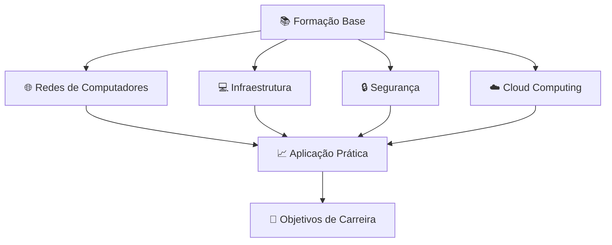

<div align="center">
  
# 🎓 Plano de Desenvolvimento Integral em Infraestrutura e Cybersegurança

*Gerenciamento de estudos e projetos que integram a formação acadêmica em Redes de Computadores com um roteiro prático de cursos focados em Infraestrutura, Segurança e Cloud.*

[](https://github.com/users/th-hoffmann/projects)
[](https://github.com/th-hoffmann)
[](https://github.com/th-hoffmann)

</div>

---

&nbsp;

## 📋 Sobre o Projeto

Este repositório serve como **centro de comando** para meu desenvolvimento profissional em Tecnologia da Informação, integrando:

- 🎯 **Formação Acadêmica**: Tecnólogo em Redes de Computadores (4 semestres - 640h)
- 📚 **Desenvolvimento Complementar**: Cursos especializados em infraestrutura, segurança e cloud
- 🚀 **Planejamento de Carreira**: Roteiro estruturado com metas e marcos

&nbsp;

## 🏗️ Estrutura do Desenvolvimento



&nbsp;

## 📊 Áreas de Foco

### 🎓 **Acadêmico**

- Disciplinas do curso de Tecnólogo em Redes de Computadores
- Projetos acadêmicos e trabalhos de conclusão
- Atividades complementares e networking acadêmico

### 🛠️ **Infraestrutura**

- Administração de sistemas Linux/Windows
- Virtualização e containers
- Monitoramento e automação

### 🔐 **Segurança**

- Segurança de redes e sistemas
- Ethical hacking e pentest
- Compliance e governança

### ☁️ **Cloud Computing**

- AWS, Azure, Google Cloud
- DevOps e CI/CD
- Arquiteturas distribuídas

&nbsp;

## 🎯 Metodologia de Estudos

### 📅 **Planejamento**

- [ ] Definição de objetivos SMART por área
- [ ] Cronograma semestral integrado
- [ ] Marcos de avaliação mensal

### 📚 **Execução**

- [ ] Sessões de estudo focado (Pomodoro)
- [ ] Projetos práticos hands-on
- [ ] Documentação de aprendizado

### 📈 **Acompanhamento**

- [ ] Métricas de progresso
- [ ] Feedback e ajustes
- [ ] Portfólio de projetos

<!--
&nbsp;

## 🗂️ Organização do Projeto

```
📁 Plano-Desenvolvimento-Integral-TI/
├── 📋 Projects/
│   ├── 🎓 Academico/
│   │   ├── 1º-Semestre/
│   │   │   ├── Tecnologia-Redes/
│   │   │   ├── Matematica-Aplicada/
│   │   │   ├── Sistema-Linux/
│   │   │   └── Cronograma-Mensal/
│   │   ├── 2º-Semestre/
│   │   ├── 3º-Semestre/
│   │   └── 4º-Semestre/
│   ├── 🛠️ Infraestrutura/
│   ├── 🔐 Seguranca/
│   └── ☁️ Cloud/
├── 📊 Tracking/
│   ├── 📅 Cronogramas/
│   ├── 📈 Metricas/
│   └── 🎯 Objetivos/
└── 📚 Recursos/
    ├── 📖 Bibliografia/
    ├── 🔗 Links-Uteis/
    └── 📝 Anotacoes/
```
-->

&nbsp;

## 🎓 Grade Curricular - Tecnólogo em Redes

### 📚 **1º Semestre** (Agosto - Dezembro 2025) - **440h**

| Disciplina | Carga Horária | Status |
|------------|---------------|---------|
| 🌐 **Tecnologia de Redes** | 80h |  |
| 📐 **Matemática Aplicada** | 60h |  |
| 🌍 **Ambientação Digital** | 20h |  |
| 📋 **Plano de Acompanhamento de Carreira I** | 10h |  |
| 🤝 **Atividades de Extensão** | 50h |  |
| 🖥️ **Redes de Computadores Remotas** | 80h |  |
| 📊 **Cabeamento Estruturado** | 60h |  |
| 🔄 **Tecnologias de Roteamento** | 80h |  |
| 🐧 **Sistema Linux** | 60h |  |
| 📝 **Avaliação Integrada I** | 0h |  |

### 📚 **2º Semestre** (2026) - **400h**

| Disciplina | Carga Horária |
|------------|---------------|
| 🏗️ Infraestrutura de Tecnologia da Informação | 40h |
| 🌐 Redes sem Fio | 60h |
| 🔄 Tecnologias em Switching | 80h |
| ☁️ Computação em Nuvem | 80h |
| 🔐 Segurança da Informação | 80h |
| 🌍 Diversidade Étnico-Cultural | 60h |

### 📚 **3º Semestre** (2026) - **400h**

| Disciplina | Carga Horária |
|------------|---------------|
| 💼 Empreendedorismo | 40h |
| 🏗️ Arquitetura de Sistemas Distribuídos | 40h |
| 🌐 Redes Heterogêneas e Conectividades | 60h |
| 🔧 Administração de Redes | 80h |
| 🛠️ Administração de Servidores | 60h |
| 🔗 Conectividade de Redes | 80h |

### 📚 **4º Semestre** (2027) - **400h**

| Disciplina | Carga Horária |
|------------|---------------|
| 🇧🇷 Língua Portuguesa | 40h |
| 🏛️ Organização e Arquitetura de Computadores | 60h |
| 💻 Programação de Computadores | 40h |
| 🌐 Redes de Computadores | 60h |
| ⚙️ Sistemas Operacionais | 60h |
| 🔧 Princípios de Administração e Marketing | 40h |

&nbsp;

## 📊 Status Detalhado - Disciplinas em Andamento

### 🌐 **Tecnologia de Redes** (83% concluído)

✅ **Módulos Concluídos:**

- Módulo 1: Tipos de Redes e Sistema Operacional de Rede
- Módulo 2: Protocolos, Padrões e Acesso a Rede
- Módulo 3: Rede Ethernet
- Módulo 4: Camada de Rede e Endereçamento IP

🟡 **Em Andamento:**

- Módulo 5: Sub-Redes e Camada de Transporte

⏳ **Próximo:**

- Módulo 6: Camada de Aplicação e Desenho Básico de Rede

### 📐 **Matemática Aplicada** (17% concluído)

🟡 **Em Andamento:**

- Módulo 1: Conjuntos e Intervalos Reais

⏳ **Próximos:**

- Módulo 2: Conjuntos Numéricos e Operações
- Módulo 3: Relações Binárias e Funções
- Módulo 4: Função Afim
- Módulo 5: Função Quadrática
- Módulo 6: Matrizes e Sistemas Lineares

### 📋 **Plano de Acompanhamento de Carreira I** (Em andamento)

🟡 **Status:**

- Atividade contínua durante todo o semestre

### 🤝 **Atividades de Extensão** (Em andamento)

🟡 **Status:**

- 50h distribuídas ao longo do semestre

&nbsp;

## 🏆 Marcos e Conquistas

### 🎓 **2025 - Fundação**

- [x] Início do curso de Tecnólogo em Redes (01/08/2025)
- [x] Setup do ambiente de estudos
- [x] **Ambientação Digital** - Concluída
- [x] Conclusão de 4 módulos de **Tecnologia de Redes**
- [ ] **Meta**: Concluir primeiro ciclo até 10/09/2025
- [ ] Primeira certificação cloud

### 🚀 **2026 - Aceleração Profissional**

- [ ] Conclusão do 1º e 2º semestre
- [ ] 5 certificações entry-level (CCST, ISC2 CC, LPIC-1)
- [ ] **🎯 META ANTECIPADA: Primeiro emprego júnior (Jun/2026)**
- [ ] Portfolio técnico sólido
- [ ] Networking profissional ativo

### 💼 **2027 - Consolidação e Crescimento**

- [ ] Conclusão do tecnólogo (4 semestres)
- [ ] Certificação CCNA (networking avançado)
- [ ] Crescimento na posição júnior
- [ ] Preparação para nível pleno

&nbsp;

## 📊 Dashboard de Progresso Atual

| Disciplina | Progresso | Status | Próximo Marco |
|------------|-----------|---------|---------------|
| 🌐 **Tecnologia de Redes** |  | 🟢 Avançado | Módulo 6 (10/09) |
| 📐 **Matemática Aplicada** |  | 🟡 Iniciando | Módulo 2 (10/09) |
| 🌍 **Ambientação Digital** |  | ✅ Concluída | - |
| � **Plano de Acompanhamento de Carreira I** |  | 🟡 Em Andamento | Contínuo |
| 🤝 **Atividades de Extensão** |  | 🟡 Em Andamento | Contínuo |
| �🖥️ **Redes de Computadores Remotas** |  | 🔴 Aguardando | Setembro 2025 |
| 📊 **Cabeamento Estruturado** |  | 🔴 Aguardando | Outubro 2025 |
| 🔄 **Tecnologias de Roteamento** |  | 🔴 Aguardando | Novembro 2025 |
| 🐧 **Sistema Linux** |  | 🔴 Aguardando | Dezembro 2025 |
| 📝 **Avaliação Integrada I** |  | 🔴 Aguardando | Dezembro 2025 |

&nbsp;

## ⏰ Próximos Deadlines

| Data | Marco | Disciplinas |
|------|-------|-------------|
| **10/09/2025** | 🎯 **Deadline Crítico** | Tecnologia de Redes + Matemática Aplicada |
| **30/09/2025** | 📝 Início Setembro | Redes de Computadores Remotas |
| **31/10/2025** | 📝 Início Outubro | Cabeamento Estruturado |
| **30/11/2025** | 📝 Início Novembro | Tecnologias de Roteamento |
| **31/12/2025** | 🏆 **Conclusão 1º Semestre** | Todas as disciplinas do semestre |

&nbsp;

## 🛠️ Ferramentas e Tecnologias

<div align="center">

### 💻 **Sistemas e Infraestrutura**


### 🌐 **Redes e Protocolos**


### ☁️ **Cloud Platforms**


### 🔐 **Segurança**


</div>

## 📚 Recursos de Estudo

### 📖 **Bibliografia Essencial**

- **Redes**: "Redes de Computadores" - Andrew Tanenbaum
- **Segurança**: "Segurança de Computadores" - William Stallings
- **Cloud**: "AWS Certified Solutions Architect" - Official Study Guide
- **Linux**: "Linux: Guia do Administrador do Sistema" - Evi Nemeth
- **Matemática**: "Matemática Discreta para Computação" - J. Gersting

### 🎯 **Certificações Alvo**

- [ ] **Cisco CCST Networking** - Fundamentos de redes Cisco
- [ ] **Cisco CCST Cybersecurity** - Segurança básica
- [ ] **ISC2 CC** - Certified in Cybersecurity
- [ ] **Linux LPIC-1** - Administração Linux
- [ ] **AWS Cloud Practitioner** - Introdução à nuvem AWS  
- [ ] **Azure Fundamentals AZ-900** - Fundamentos Microsoft Azure
- [ ] **Cisco CCNA** - Networking profissional

<!--
### 🔗 **Links Úteis**
- [Packet Tracer - Simulador Cisco](https://www.netacad.com/courses/packet-tracer)
- [GNS3 - Simulador de Redes](https://www.gns3.com/)
- [AWS Free Tier](https://aws.amazon.com/free/)
- [Linux Journey](https://linuxjourney.com/)
- [Khan Academy - Matemática](https://pt.khanacademy.org/math)
-->

## 📞 Contato e Networking

<div align="center">

[](https://linkedin.com/in/th-hoffmann87)
[](https://github.com/th-hoffmann)
[](mailto:thiago@hoffmann.tec.br)

</div>

---

<div align="center">

### 💡 *"A educação é a arma mais poderosa que você pode usar para mudar o mundo."* - Nelson Mandela

#### 🚀 Transformando conhecimento em oportunidades | 📈 Crescimento acelerado em TI**
  
#### ⏰ Próximo Marco: 10/09/2025 - Conclusão do primeiro ciclo**

#### 🎯 Meta Ambiciosa: Jun/2026 - Primeiro emprego júnior**

</div>

---

<div align="center">
  <sub>
    Desenvolvido com ❤️ por <a href="https://github.com/th-hoffmann">th-hoffmann</a>
    <br>
    <em>Última atualização: 04 de September de 2025
  </sub>
</div>
