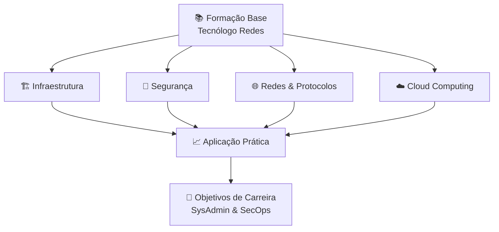

# 🏗️🔐 Plano de Desenvolvimento Integral em Infraestrutura e Segurança

> Plano estruturado de desenvolvimento profissional focado em Infraestrutura e Segurança, integrado à formação acadêmica em Tecnólogo em Redes de Computadores

---

## 📊 Status do Progresso

| Área | Progresso | Status |
|------|-----------|--------|
| 🎓 **Tecnólogo em Redes de Computadores** | **83%** | `25/30 disciplinas concluídas` |
| 🏗️ **Infraestrutura** | **20%** | `Em desenvolvimento` |
| 🔐 **Segurança** | **10%** | `Iniciando` |
| 📅 **Conclusão prevista** | - | `10/09/2025` |

---

## 🗺️ Mapa de Desenvolvimento



---

## 🛤️ Trilhas de Desenvolvimento

### 🏗️ **TRILHA INFRAESTRUTURA**

- **Fundamentos**: Linux LPIC-1, Windows Server
- **Virtualização**: VMware, Docker, Kubernetes  
- **Cloud**: AWS SAA, Azure Fundamentals
- **Automação**: Terraform, Ansible, IaC
- **Monitoramento**: Zabbix, Prometheus, Grafana

### 🔐 **TRILHA SEGURANÇA**

- **Base**: CompTIA Security+
- **Offensive**: CEH, OSCP
- **Defensive**: SOC Analyst, SIEM
- **Compliance**: ISO 27001, LGPD
- **Ferramentas**: Nmap, Metasploit, Wireshark

---

## 📅 Cronograma de Certificações 2024-2025

| Data | Certificação | Status | Prioridade |
|------|--------------|--------|------------|
| 2024-12 | CompTIA Security+ | 🎯 Próxima | Alta |
| 2025-02 | LPIC-1 | 📝 Planejada | Alta |
| 2025-05 | AWS SAA | 📝 Planejada | Média |
| 2025-08 | CEH | 📝 Planejada | Média |

---

## 🎓 Progresso Acadêmico Atual

- ✅ **Disciplinas concluídas**: 25/30
- 🔄 **Em andamento**: Segurança de Redes, Administração de Sistemas
- ⏳ **Restantes**: 3 disciplinas + TCC
- 📅 **Previsão de conclusão**: 10/09/2025

---

## 📁 Estrutura do Projeto

```
📁 carreira-infra-security/
├── 📚 estudos/
│   ├── 🏗️ infraestrutura/
│   ├── 🔐 seguranca/
│   ├── 🎓 academico/
│   └── ☁️ cloud/
├── 📋 certificacoes/
├── 🛠️ projetos-praticos/
├── 📖 recursos-materiais/
└── 📊 acompanhamento-progresso/
```

---

## 📈 Dashboard de Progresso

| Área | Percentual | Detalhamento |
|------|------------|--------------|
| 🎓 **Acadêmico** | `83%` | 25/30 disciplinas |
| 🏗️ **Infraestrutura** | `20%` | Iniciando Linux |
| 🔐 **Segurança** | `10%` | Fundamentos |
| ☁️ **Cloud** | `5%` | Conceitos básicos |

---

## 🎯 Próximos Passos

1. **📖 Finalizar disciplinas em andamento** (Segurança de Redes, Administração de Sistemas)
2. **📝 Preparação CompTIA Security+** (Dezembro 2024)
3. **🏗️ Aprofundar conhecimentos Linux** (LPIC-1 preparação)
4. **☁️ Iniciar estudos AWS** (SAA Foundation)

---

## 📞 Contato & Acompanhamento

- **GitHub**: Acompanhamento através de Projects e Issues
- **Timeline**: Atualizada semanalmente
- **Milestone**: Graduação em 10/09/2025
