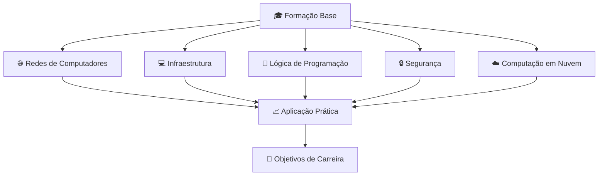

<div align="center">
  
# 🎓 Plano de Desenvolvimento Integral em Infraestrutura e Cybersegurança

*Gerenciamento de estudos e projetos que integram a formação acadêmica Tecnologia em Redes de Computadores com um roteiro prático de cursos focados em Infraestrutura, Segurança e Computação em Nuvem.*

[](https://github.com/users/th-hoffmann/projects)
[](https://github.com/th-hoffmann)
[](https://github.com/th-hoffmann)

</div>

---

&nbsp;

## 📋 Sobre o Projeto

Este repositório em conjunto com sua [página do Github Projects](https://github.com/users/th-hoffmann/projects/3) servem como **centro de comando** para meu desenvolvimento profissional em Tecnologia da Informação, integrando:

- 🎓 **Formação Acadêmica**: Tecnologia em Redes de Computadores (4 semestres - 640h)
- 📚 **Desenvolvimento Complementar**: Cursos especializados em infraestrutura, segurança e computação em nuvem.
- 🚀 **Planejamento de Carreira**: Roteiro estruturado com metas e marcos definidos.

&nbsp;

## 🏗️ Estrutura do Desenvolvimento



&nbsp;

## 📊 Áreas de Foco

### 🎓 **Acadêmico**

- Disciplinas do curso de Tecnólogo em Redes de Computadores
- Projetos acadêmicos e trabalhos de conclusão
- Atividades complementares e networking acadêmico

### 🛠️ **Infraestrutura**

- Administração de sistemas Linux/Windows
- Virtualização e containers
- Monitoramento e automação

### 🔐 **Segurança**

- Segurança de redes e sistemas
- Ethical hacking e pentest
- Compliance e governança

### ☁️ **Cloud Computing**

- AWS, Azure, Google Cloud
- DevOps e CI/CD
- Arquiteturas distribuídas

&nbsp;

## 🎯 Metodologia de Estudos

### 📅 **Planejamento**

- [ ] Definição de objetivos SMART por área
- [ ] Cronograma semestral integrado
- [ ] Marcos de avaliação mensal

### 📚 **Execução**

- [ ] Sessões de estudo focado (Pomodoro)
- [ ] Projetos práticos hands-on
- [ ] Documentação de aprendizado

### 📈 **Acompanhamento**

- [ ] Métricas de progresso
- [ ] Feedback e ajustes
- [ ] Portfólio de projetos

<!--
&nbsp;

## 🗂️ Organização do Projeto

```
📁 Plano-Desenvolvimento-Integral-TI/
├── 📋 Projects/
│   ├── 🎓 Academico/
│   │   ├── 1º-Semestre/
│   │   │   ├── Tecnologia-Redes/
│   │   │   ├── Matematica-Aplicada/
│   │   │   ├── Sistema-Linux/
│   │   │   └── Cronograma-Mensal/
│   │   ├── 2º-Semestre/
│   │   ├── 3º-Semestre/
│   │   └── 4º-Semestre/
│   ├── 🛠️ Infraestrutura/
│   ├── 🔐 Seguranca/
│   └── ☁️ Cloud/
├── 📊 Tracking/
│   ├── 📅 Cronogramas/
│   ├── 📈 Metricas/
│   └── 🎯 Objetivos/
└── 📚 Recursos/
    ├── 📖 Bibliografia/
    ├── 🔗 Links-Uteis/
    └── 📝 Anotacoes/
```
-->

&nbsp;

## 📚 Grade Curricular

### 🎓 Tecnologia em Redes de Computadores

<div align="center">

**📚 NAVEGAÇÃO POR SEMESTRE 📚**

| [🎯 1º Semestre](#1º-semestre-atual) | [📘 2º Semestre](#2º-semestre) | [📙 3º Semestre](#3º-semestre) | [� 4º Semestre](#4º-semestre) |
|:---:|:---:|:---:|:---:|
| **ATUAL** | **FUTURO** | **FUTURO** | **FUTURO** |
| 440h | 400h | 400h | 400h |

</div>

---

<table align="center" width="100%">
<tr>
<td align="center" width="25%">

### [🎯 1º Semestre](#primeiro-semestre)
**Agosto - Dezembro 2025**  
**440h** | **ATUAL**

</td>
<td align="center" width="25%">

### [� 2º Semestre](#segundo-semestre)
**2026**  
**400h** | **FUTURO**

</td>
<td align="center" width="25%">

### [📙 3º Semestre](#terceiro-semestre)
**2026**  
**400h** | **FUTURO**

</td>
<td align="center" width="25%">

### [📗 4º Semestre](#quarto-semestre)
**2027**  
**400h** | **FUTURO**

</td>
</tr>
</table>

---

<div id="primeiro-semestre"></div>

<details open>
<summary>
<h3 align="center">🎯 <strong>1º SEMESTRE - ATUAL</strong> (Agosto - Dezembro 2025) | 440h</h3>
</summary>

<div align="center">

**📊 PROGRESSO ATUAL: 50% CONCLUÍDO**

</div>

| Disciplina | Carga Horária | Status |
|------------|---------------|--------|
| 🌍 **Ambientação Digital** | 20h |  |
| 📐 **Matemática Aplicada** | 60h |  |
| 🌐 **Tecnologia de Redes** | 80h |  |
| 🖥️ **Redes de Computadores Remotas** | 80h |  |
| 🤝 **Atividades de Extensão** | 50h |  |
| 📋 **Plano de Acompanhamento de Carreira I** | 10h |  |
| 📊 **Cabeamento Estruturado** | 60h |  |
| 🔄 **Tecnologias de Roteamento** | 80h |  |
| 🐧 **Sistema Linux** | 60h |  |
| 📝 **Avaliação Integrada I** | 0h |  |

<div align="center">

**🎯 FOCO:** Fundamentos de Redes e Infraestrutura  
**� CONCLUSÃO PREVISTA:** Dezembro 2025  
**🏆 META:** Base sólida para semestres avançados

</div>

</details>

---

<div id="segundo-semestre"></div>

<details>
<summary>
<h3 align="center">📘 <strong>2º SEMESTRE</strong> (2026) | 400h</h3>
</summary>

<div align="center">

**📊 PROGRESSO: 0% - PLANEJADO**

</div>

| Disciplina | Carga Horária | Status |
|------------|---------------|--------|
| 🏗️ **Infraestrutura de Tecnologia da Informação** | 40h |  |
| 🌐 **Redes sem Fio** | 60h |  |
| 🔄 **Tecnologias em Switching** | 80h |  |
| ☁️ **Computação em Nuvem** | 80h |  |
| 🔐 **Segurança da Informação** | 80h |  |
| 🌍 **Diversidade Étnico-Cultural** | 60h |  |

<div align="center">

**🎯 FOCO:** Infraestrutura, Cloud e Segurança  
**📅 INÍCIO PREVISTO:** Janeiro 2026  
**🏆 META:** Especialização em tecnologias avançadas

</div>

</details>

---

<div id="terceiro-semestre"></div>

<details>
<summary>
<h3 align="center">� <strong>3º SEMESTRE</strong> (2026) | 400h</h3>
</summary>

<div align="center">

**📊 PROGRESSO: 0% - PLANEJADO**

</div>

| Disciplina | Carga Horária | Status |
|------------|---------------|--------|
| 💼 **Empreendedorismo** | 40h |  |
| 🏗️ **Arquitetura de Sistemas Distribuídos** | 40h |  |
| 🌐 **Redes Heterogêneas e Conectividades** | 60h |  |
| 🔧 **Administração de Redes** | 80h |  |
| 🛠️ **Administração de Servidores** | 60h |  |
| 🔗 **Conectividade de Redes** | 80h |  |

<div align="center">

**🎯 FOCO:** Administração e Arquiteturas Avançadas  
**📅 INÍCIO PREVISTO:** Julho 2026  
**🏆 META:** Competências administrativas profissionais

</div>

</details>

---

<div id="quarto-semestre"></div>

<details>
<summary>
<h3 align="center">� <strong>4º SEMESTRE</strong> (2027) | 400h</h3>
</summary>

<div align="center">

**📊 PROGRESSO: 0% - PLANEJADO**

</div>

| Disciplina | Carga Horária | Status |
|------------|---------------|--------|
| 🇧🇷 **Língua Portuguesa** | 40h |  |
| 🏛️ **Organização e Arquitetura de Computadores** | 60h |  |
| 💻 **Programação de Computadores** | 40h |  |
| 🌐 **Redes de Computadores** | 60h |  |
| ⚙️ **Sistemas Operacionais** | 60h |  |
| 🔧 **Princípios de Administração e Marketing** | 40h |  |

<div align="center">

**🎯 FOCO:** Consolidação e Formação Completa  
**📅 INÍCIO PREVISTO:** Janeiro 2027  
**🏆 META:** Conclusão do Tecnólogo

</div>

</details>

&nbsp;

---

### 🌐 Trilhas de Aprendizado Cisco Networking Academy

<div align="center">

**🎯 NAVEGAÇÃO POR TRILHA 🎯**

| [🌐 Técnico em Redes](#trilha-tecnico-redes) | [🛡️ Analista de Cibersegurança](#trilha-ciberseguranca) |
|:---:|:---:|
| **CCST Networking** | **CCST Cybersecurity** |
| Set/2025 - Mar/2026 | Set/2025 - Mai/2026 |

</div>

---

<div id="trilha-tecnico-redes"></div>

<details>
<summary>
<h3 align="center">🌐 <strong>TÉCNICO EM REDES</strong> (Set/2025 - Mar/2026) | CCST Networking</h3>
</summary>

<div align="center">

**📊 PROGRESSO ATUAL: 0% - PREPARAÇÃO**

**🎯 Certificação Alvo:** Cisco CCST Networking  
**📅 Data do Exame:** 15 de Março de 2026  
**🏆 Meta de Score:** 85%

</div>

| Curso | Carga Horária | Status |
|-------|---------------|--------|
| 🌐 **Conceitos Básicos de Redes** | 30h |  |
| 🔧 **Dispositivos de Rede e Configuração** | 35h |  |
| 📊 **Endereçamento de Rede** | 25h |  |
| 🛡️ **Suporte e Segurança de Rede** | 40h |  |

<div align="center">

**🎯 FOCO:** Fundamentos de Redes Cisco  
**� CONCLUSÃO PREVISTA:** Março 2026  
**🏆 META:** Certificação CCST Networking

</div>

</details>

---

<div id="trilha-ciberseguranca"></div>

<details>
<summary>
<h3 align="center">🛡️ <strong>ANALISTA DE CIBERSEGURANÇA</strong> (Set/2025 - Mai/2026) | CCST Cybersecurity</h3>
</summary>

<div align="center">

**📊 PROGRESSO ATUAL: 0% - PREPARAÇÃO**

**🎯 Certificação Alvo:** Cisco CCST Cybersecurity  
**📅 Data do Exame:** 15 de Maio de 2026  
**🏆 Meta de Score:** 85%

</div>

| Curso | Carga Horária | Status |
|-------|---------------|--------|
| 🛡️ **Introdução à Cibersegurança** | 25h |  |
| 🌐 **Conceitos Básicos de Redes** | 30h |  |
| 🔧 **Dispositivos de Rede e Configuração Inicial** | 35h |  |
| 🖥️ **Segurança de Endpoint** | 40h |  |
| 🛡️ **Defesa de Rede** | 45h |  |
| 🎯 **Gerenciamento de Ameaças Cibernéticas** | 35h |  |

<div align="center">

**🎯 FOCO:** Segurança e Proteção Cisco  
**� CONCLUSÃO PREVISTA:** Maio 2026  
**🏆 META:** Certificação CCST Cybersecurity

</div>

</details>

&nbsp;

&nbsp;

## 📊 Status Detalhado - Disciplinas em Andamento

### 🌐 **Tecnologia de Redes** (100% concluído)

✅ **Módulos Concluídos:**

- Módulo 1: Tipos de Redes e Sistema Operacional de Rede
- Módulo 2: Protocolos, Padrões e Acesso a Rede
- Módulo 3: Rede Ethernet
- Módulo 4: Camada de Rede e Endereçamento IP
- Módulo 5: Sub-Redes e Camada de Transporte
- Módulo 6: Camada de Aplicação e Desenho Básico de Rede

### 📐 **Matemática Aplicada** (100% concluído)

✅ **Módulos Concluídos:**

- Módulo 1: Conjuntos e Intervalos Reais
- Módulo 2: Conjuntos Numéricos e Operações
- Módulo 3: Relações Binárias e Funções
- Módulo 4: Função Afim
- Módulo 5: Função Quadrática
- Módulo 6: Matrizes e Sistemas Lineares

### 🖥️ **Redes de Computadores Remotas** (Em andamento)

✅ **Módulos Concluídos:**

🟡 **Em Andamento:**

- Módulo 1: Acesso Remoto

⏳ **Próximos:**

- Módulo 2: Aplicação para Rede Virtual
- Módulo 3: Computação em Nuvem e Internet
- Módulo 4: Integração das Redes Remotas
- Módulo 5: Rádio Frequência
- Módulo 6: Redes Remotas

&nbsp;

### 📋 **Plano de Acompanhamento de Carreira I** (Em andamento)

🟡 **Status:**

- Atividade contínua durante todo o semestre

&nbsp;

### 🤝 **Atividades de Extensão** (Em andamento)

🟡 **Status:**

- 50h distribuídas ao longo do semestre

&nbsp;

## 🏆 Marcos e Conquistas

### 🎓 **2025 - Fundação**

- [x] **Início da graduação Tecnologia em Redes de Computadores (01/08/2025)**
- [x] **Configuração do ambiente de estudos**
- [x] **Ambientação Digital**
- [x] **Tecnologia de Redes**
- [x] **Matematica Aplicada**
- [ ] **Redes de Computadores Remotas**
- [ ] **Cabeamento Estruturado**
- [ ] **Tecnologias de Roteamento**
- [ ] **Sistema Linux**
- [ ] **Atividade de Extensão**
- [ ] **Plano de Acompanhamento de Carreira I**
- [ ] **Conclusão do 1º Semestre**
- [ ] Primeira certificação: CCST - Networking

### 🚀 **2026 - Aceleração Profissional**

- [ ] **Conclusão do 2º e 3º semestres**
- [ ] **3 certificações entry-level (CCST - Security, ISC2 - CC, LPIC-1)**
- [ ] **🎯 META: Primeiro emprego júnior (Jun/2026)**
- [ ] **Portfolio técnico sólido**
- [ ] **Networking profissional ativo**

### 💼 **2027 - Consolidação e Crescimento**

- [ ] **Conclusão do tecnólogo (4 semestres)**
- [ ] **Certificação CCNA (networking avançado)**
- [ ] **Crescimento na posição júnior**
- [ ] **Preparação para nível pleno**

&nbsp;

## 📊 Dashboard de Progresso Atual

| Disciplina | Progresso | Status | Próximo Marco |
|------------|-----------|---------|---------------|
| 🌍 **Ambientação Digital** |  | ✅ Concluída | - |
| 📐 **Matemática Aplicada** |  | ✅ Concluída | - |
| 🌐 **Tecnologia de Redes** |  | ✅ Concluída | - |
| �🖥️ **Redes de Computadores Remotas** |  | 🟡 Iniciando  | 01/10/2025 |
| 🤝 **Atividades de Extensão** |  | 🟡 Em Andamento | Contínuo |
| � **Plano de Acompanhamento de Carreira I** |  | 🟡 Em Andamento | Contínuo |
| 📊 **Cabeamento Estruturado** |  | 🔴 Aguardando | Outubro 2025 |
| 🔄 **Tecnologias de Roteamento** |  | 🔴 Aguardando | Novembro 2025 |
| 🐧 **Sistema Linux** |  | 🔴 Aguardando | Dezembro 2025 |
| 📝 **Avaliação Integrada I** |  | 🔴 Aguardando | Dezembro 2025 |

&nbsp;

## ⏰ Próximos Deadlines

| Data | Marco | Disciplinas |
|------|-------|-------------|
| **10/09/2025** | 🎯 Setembro | Tecnologia de Redes + Matemática Aplicada |
| **30/09/2025** | 📝 Início Outubro | Redes de Computadores Remotas |
| **31/10/2025** | 📝 Início Novembro | Cabeamento Estruturado |
| **30/11/2025** | 📝 Início Dezembro | Tecnologias de Roteamento |
| **31/12/2025** | 🏆 **Conclusão 1º Semestre** | Todas as disciplinas do semestre |

&nbsp;

## 🛠️ Ferramentas e Tecnologias

<div align="center">

### 💻 **Sistemas e Infraestrutura**


### 🌐 **Redes e Protocolos**


### ☁️ **Cloud Platforms**


### 🔐 **Segurança**


</div>


### 🎯 **Certificações Alvo**

- [ ] **Cisco CCST Networking** - Fundamentos de redes Cisco
- [ ] **Cisco CCST Cybersecurity** - Segurança básica
- [ ] **ISC2 CC** - Certified in Cybersecurity
- [ ] **Linux LPIC-1** - Administração Linux
- [ ] **AWS Cloud Practitioner** - Introdução à nuvem AWS  
- [ ] **Azure Fundamentals AZ-900** - Fundamentos Microsoft Azure
- [ ] **Cisco CCNA** - Networking profissional

<!--
### 🔗 **Links Úteis**
- [Packet Tracer - Simulador Cisco](https://www.netacad.com/courses/packet-tracer)
- [GNS3 - Simulador de Redes](https://www.gns3.com/)
- [AWS Free Tier](https://aws.amazon.com/free/)
- [Linux Journey](https://linuxjourney.com/)
- [Khan Academy - Matemática](https://pt.khanacademy.org/math)
-->

## 📞 Contato e Networking

<div align="center">

[](https://linkedin.com/in/th-hoffmann87)
[](https://github.com/th-hoffmann)
[](mailto:thiago@hoffmann.tec.br)

</div>

---

<div align="center">

### 💡 *"A educação é a arma mais poderosa que você pode usar para mudar o mundo."* - Nelson Mandela

#### 🚀 Transformando conhecimento em oportunidades | 📈 Crescimento acelerado em TI**
  
#### ⏰ Próximo Marco: 01/10/2025 - Conclusão do segundo ciclo de disciplinas**

#### 🎯 Meta Ambiciosa: Jun/2026 - Primeiro emprego júnior**

</div>

---

<div align="center">
  <sub>
    Desenvolvido com ❤️ por <a href="https://github.com/th-hoffmann">th-hoffmann</a>
    <br>
    <em>Última atualização: 12 de September de 2025
  </sub>
</div>
