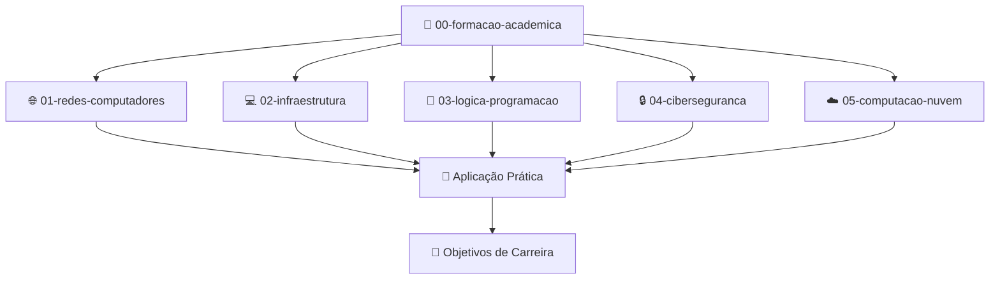

<div align="center">

# 📚 Materiais de Estudo

### Biblioteca pessoal de conhecimento técnico e acadêmico


</div>

---

## 📋 Sobre este Diretório

Este é meu centro de conhecimento pessoal para documentar e organizar toda a jornada de aprendizado em tecnologia. Aqui reúno materiais do curso superior em Tecnologia em Redes de Computadores, certificações profissionais e estudos independentes, todos organizados por áreas de expertise. 

Este repositório serve como uma **base de conhecimento estruturada** que:
- **Documenta** minha evolução acadêmica e profissional
- **Centraliza** recursos de estudo, resumos e códigos em um único local 
- **Integra-se** com o sistema de rastreamento de progresso via GitHub Issues
- **Organiza** conteúdos de forma lógica para facilitar revisões e consultas
- **Demonstra** competências técnicas adquiridas através de projetos práticos

## 🗂️ Estrutura de Organização

O conteúdo está organizado em uma estrutura numerada que reflete o fluxo lógico de aprendizagem:

```
📁 materiais-estudo/
├── 📁 00-formacao-academica/     # 🏫 Base acadêmica do curso técnico
├── 📁 01-redes-computadores/     # 🌐 Tecnologias e protocolos de redes
├── 📁 02-infraestrutura/         # 💻 Sistemas operacionais e serviços
├── 📁 03-logica-programacao/     # 🧠 Desenvolvimento e automação
├── 📁 04-ciberseguranca/         # 🔒 Cibersegurança e proteção de dados
└── 📁 05-computacao-nuvem/       # ☁️ Tecnologias cloud
```

## 🔄 Fluxo de Conhecimento



## 📑 Tipos de Conteúdo

Cada área contém os seguintes tipos de material:

| Tipo | Descrição | Formato |
|------|-----------|---------|
| **📝 Resumos** | Sínteses concisas de conceitos teóricos | Markdown (.md) |
| **📒 Anotações** | Observações e insights pessoais | Markdown (.md) |
| **💻 Códigos** | Scripts e programas desenvolvidos | Arquivos de código (.py, .sh, etc.) |
| **🧪 Exercícios** | Atividades práticas resolvidas | Diversos formatos |
| **📊 Laboratórios** | Documentação de ambientes práticos | Markdown com capturas de tela |

## 🎯 Áreas de Conhecimento

### 🏫 00-formacao-academica
Contém os materiais relacionados ao curso de Tecnologia em Redes de Computadores, organizados por semestre e disciplina.

**O que você encontrará aqui:**
- Resumos detalhados de cada módulo das disciplinas acadêmicas
- Anotações de aulas com insights e pontos-chave
- Resoluções de exercícios e atividades avaliativas
- Sínteses de aprendizado ao final de cada semestre

### 🌐 01-redes-computadores
Centro de conhecimento em tecnologias e protocolos de redes.

**O que você encontrará aqui:**
- Resumos de conceitos fundamentais de redes
- Documentação sobre protocolos (TCP/IP, DNS, DHCP)
- Configurações de equipamentos (roteadores, switches)
- Materiais para certificações Cisco (CCST, CCNA)
- Resumos técnicos sobre cabeamento estruturado

### 💻 02-infraestrutura
Biblioteca de conhecimento sobre sistemas operacionais e serviços.

**O que você encontrará aqui:**
- Administração de sistemas Linux
- Virtualização e containers
- Serviços essenciais (DNS, DHCP, Active Directory)
- Configuração de servidores
- Automação de infraestrutura

### 🧠 03-logica-programacao
Repositório de desenvolvimento e automação.

**O que você encontrará aqui:**
- Conceitos de programação
- Scripts Python para operações de rede e segurança
- Shell scripts (Bash) para automação
- Algoritmos aplicados a problemas de TI
- Projetos de desenvolvimento

### 🔒 04-ciberseguranca
Centro de conhecimento em segurança da informação.

**O que você encontrará aqui:**
- Conceitos de segurança da informação
- Vulnerabilidades e técnicas de mitigação
- Laboratórios práticos e testes de invasão
- Materiais para certificações (CCST Security, ISC² CC)
- Frameworks de segurança (NIST, ISO 27001)

### ☁️ 05-computacao-nuvem
Biblioteca sobre tecnologias e serviços em nuvem.

**O que você encontrará aqui:**
- Conhecimentos sobre provedores cloud (AWS, Azure, GCP)
- Arquiteturas cloud e boas práticas
- Infraestrutura como código (Terraform, CloudFormation)
- Preparação para certificações cloud
- Comparativos entre serviços dos diferentes provedores

## 📌 Convenções de Nomenclatura

- **Arquivos de Resumo**: `resumo-[tema].md`
- **Arquivos de Laboratório**: `lab-[tema].md`
- **Arquivos de Exercícios**: `exercicio-[tema].[extensão]`
- **Códigos**: `[nome-descritivo].[extensão]`

## 🔍 Integração com Issues

Os materiais estão vinculados ao sistema de issues do GitHub para rastreamento de progresso:

- Cada resumo ou atividade prática referencia a issue correspondente
- O formato padrão de metadados no início de cada arquivo Markdown inclui o número da issue
- Isso permite acompanhar a evolução do conhecimento em relação às metas acadêmicas e profissionais

### 📋 Estrutura de Metadados dos Arquivos

Cada arquivo de resumo ou documentação segue este padrão de metadados:

```markdown
---
Issue: #42
Curso/Disciplina: Tecnologia de Redes
Módulo: Protocolos de Rede
Data: 2025-10-08
Plataforma: Unicesumar
Instrutor: Nome do Professor
Completude: 100%
---

# Título do Resumo ou Documentação
```

---

<div align="center">

### 📅 Última atualização: Outubro 2025
### 🔄 Conteúdo atualizado regularmente conforme avanço nos estudos

</div>
