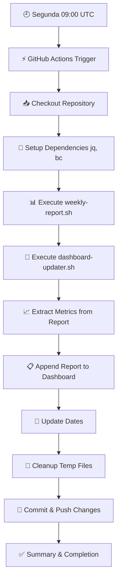

# 🔄 Sistema de Automação Integrado

## 📋 Visão Geral

Este sistema integra **3 componentes principais** para automatizar completamente a atualização do dashboard de progresso baseado nas issues reais do GitHub.

## 🛠️ Componentes do Sistema

### 1️⃣ **weekly-report.sh**

- **Função**: Analisa issues do GitHub e gera relatório estruturado
- **Dados extraídos**: Progresso por categoria, issues fechadas/criadas, deadlines
- **Output**: Relatório markdown com métricas calculadas

### 2️⃣ **dashboard-updater.sh**

- **Função**: Atualiza badges e métricas no DASHBOARD_KPIS.md
- **Dados atualizados**: Badges de progresso, status das disciplinas, datas
- **Integração**: Lê progresso real das issues (#2-#7)

### 3️⃣ **weekly-update.yml** (GitHub Actions)

- **Função**: Orquestra todo o processo automaticamente
- **Trigger**: Toda segunda-feira às 09:00 UTC + manual via workflow_dispatch
- **Fluxo completo**: Scripts → Extração → Atualização → Commit

## 🔄 Fluxo de Execução



## 📊 Dados Automatizados

### **🎯 Métricas Calculadas Automaticamente:**

- **Progresso Acadêmico**: Baseado nas issues #2-#7
- **Progresso por Disciplina**: Extraído do corpo das issues
- **Issues Fechadas/Criadas**: Análise semanal automática
- **Badges Coloridos**: Verde/Amarelo/Vermelho baseado no %
- **Status Textual**: Excelente/Bom/Regular/Atrasado/Crítico

### **🔄 Sincronização Bidirecional:**

- **Issues → Dashboard**: Progresso real refletido no dashboard
- **Dashboard → Relatórios**: Métricas consolidadas em relatórios
- **Histórico**: Relatórios semanais acumulados

## ⚡ Execução Manual

```bash
# Executar apenas relatório semanal
./scripts/weekly-report.sh

# Executar apenas atualização do dashboard  
./scripts/dashboard-updater.sh

# Executar workflow completo manualmente
gh workflow run "📊 Weekly Progress Update"
```

## 🎯 Benefícios da Integração

### ✅ **Automatização Completa:**

- **Zero intervenção manual** necessária
- **Dados sempre atualizados** com a realidade das issues
- **Histórico automático** de progresso semanal

### ✅ **Precisão de Dados:**

- **Badges sincronizados** com progresso real
- **Métricas calculadas** diretamente das issues
- **Sem dessincronia** entre dashboard e realidade

### ✅ **Escalabilidade:**

- **Funciona com qualquer quantidade** de issues
- **Facilmente extensível** para novas categorias
- **Configurável** via labels do GitHub

### ✅ **Transparência:**

- **Commits automatizados** com detalhes das mudanças
- **Logs completos** de cada execução
- **Rastreabilidade total** do processo

## 🔧 Configuração Necessária

### **Permissões GitHub:**

- `GITHUB_TOKEN` com acesso de leitura/escrita ao repositório
- Permissões para GitHub CLI (`gh`)

### **Dependências do Sistema:**

- `jq` - Para processamento JSON
- `bc` - Para cálculos matemáticos
- `sed` - Para substituições de texto

### **Estrutura de Issues:**

- Issues #2-#7 representam disciplinas
- Progresso no formato `██████░░░░ XX%` ou `Progresso Atual: XX%`
- Labels organizadas por categoria

## 📈 Exemplo de Resultado

### **Antes (Manual):**

```markdown
📚 **Progresso Acadêmico** |  | 🚨 Crítico
```

### **Depois (Automatizado):**

```markdown
📚 **Progresso Acadêmico** |  | 🟡 Regular
```

**+ Relatório semanal automático anexado ao final do dashboard!**

---

## 🚀 **Resultado Final**

Um sistema **completamente automatizado** que:

- 🔄 **Sincroniza** dashboard com issues reais
- 📊 **Gera** relatórios semanais automaticamente  
- 📈 **Atualiza** badges e métricas precisas
- 💾 **Commita** mudanças com mensagens detalhadas
- ⏰ **Executa** toda segunda-feira sem intervenção

## O dashboard agora é uma representação fiel e sempre atualizada do progresso real! 🎯
